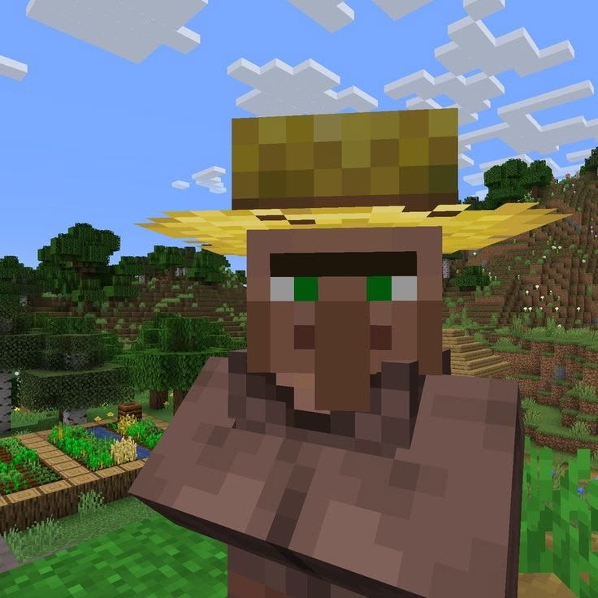

# 💎 Tiny Stone

**Tiny-stone** is a custom-built Minecraft server engine written in C++, technically inspired by the **Stoneblock** gameplay concept.

It is designed to be lightweight, fast, and fully custom-tailored, giving players a unique underground survival environment powered by a high-performance C++ backend.

## 💡 Key Features
* 🚀 **C++ Native Performance:** Written completely in C++ for maximum execution speed, low latency, and zero Java Garbage Collection spikes.
* 🪨 **Custom Stoneblock Mechanics:** Built specifically to handle unique underground generation and stone-based survival logic from the ground up.
* 🪶 **Ultra Lightweight:** Consumes extremely low memory (RAM) with near-instantaneous startup times.

## 🚫 IMPORTANT (DISCLAIMER) & WARNING

> [!CAUTION]
> **PLEASE READ BEFORE RUNNING THE SERVER!**

* 🚧 **Experimental Phase:** *Tiny-stone* is a passion project built primarily for learning, custom protocol experimentation, and development. It is **not** yet production-ready for public servers with large player bases!
* 🐛 **Expect Bugs & Crashes:** Since this engine uses raw low-level C++ networking and manual memory management, expect potential memory leaks, segmentation faults (*segfaults*), or unexpected disconnects if code is modified carelessly.
* 📦 **Incomplete Vanilla Features:** Do not expect a fully featured vanilla Minecraft experience out of the box—the main focus right now is building a solid, lightweight core architecture.
* 🛡️ **Use at Your Own Risk:** Always test in a safe local environment before attempting to deploy or host.

### reviews

    <t>
        
        "this server is great for me and my friend" - Jefry (5 Stars)
    </t>

(Photo of Jefry)

    <t>
        
        "I recommended this for y'all" - Also Jefry (Also 5 Stars)
    </t>

(Another photo of Jefry)